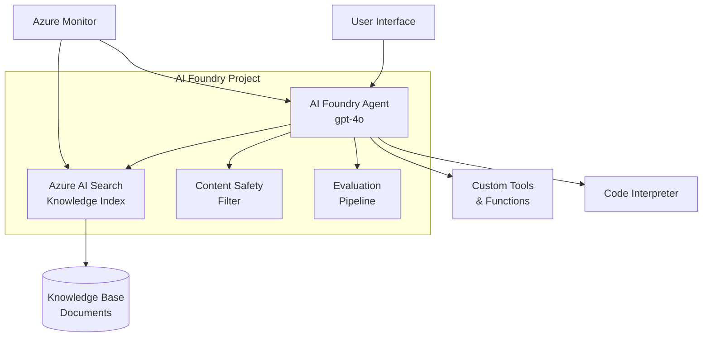

# Hands-On Lab: Choose Your Capstone Project

## Module 41 — Azure AI Foundry: Zero to Hero

> **Arc:** ARC 9 · CAPSTONE & MASTERY
> **Duration:** 90 minutes
> **Level:** Advanced
> **Date:** April 2026

---

## 🎯 Lab Objectives

By completing this lab, you will:

1. Select a capstone project idea and validate it against scope criteria
2. Write structured user stories and non-functional requirements
3. Design an end-to-end architecture using AI Foundry services
4. Define SMART success criteria with measurable evaluation metrics
5. Produce a complete project proposal document (PROPOSAL.md)
6. Create an architecture diagram showing all components and data flows

## 🔧 Prerequisites

- Completion of Modules 1–40 (or equivalent experience)
- Azure subscription with an AI Foundry project provisioned
- Python 3.10+ with `azure-ai-projects` and `azure-ai-evaluation` installed
- A text editor or IDE (VS Code recommended)
- A diagramming tool (draw.io, Excalidraw, Mermaid, or whiteboard)

---

## Exercise 1: Select Your Capstone Project (15 min)

### Step 1.1 — Review Curated Project Ideas

Review the following project ideas and select one that aligns with your interests and skill level:

| # | Project | Domain | Complexity | Key Services |
|---|---------|--------|------------|-------------|
| 1 | Healthcare Triage Agent | Healthcare | Advanced | Agents, AI Search, Content Safety |
| 2 | Enterprise BI Copilot | Business Intelligence | Advanced | Agents, Code Interpreter, Multi-model |
| 3 | Intelligent Document Pipeline | Document Processing | Intermediate | Agents, AI Search, Functions |
| 4 | E-Commerce Shopping Agent | Retail | Intermediate | Agents, AI Search, Function Tools |
| 5 | SOC Security Agent | Cybersecurity | Expert | Multi-agent, Event-driven, Monitor |
| 6 | Multilingual Support Hub | Customer Service | Advanced | Agents, AI Services, AI Search |
| 7 | Your Own Idea | Any | Any | Must pass Scope Fitness Test |

### Step 1.2 — Validate Against the Scope Fitness Test

For your chosen project, check each criterion:

```markdown
## Scope Fitness Test

- [ ] Uses ≥ 3 AI Foundry services
- [ ] Includes at least one agent with tool integrations
- [ ] Connects to at least one external data source
- [ ] Implements content safety / responsible AI guardrails
- [ ] Includes basic monitoring and logging
- [ ] Completable within 3 module build sprints (Modules 42-44)
```

### Step 1.3 — Document Your Choice

Create a new file called `PROPOSAL.md` in your project directory. Start with:

```markdown
# Capstone Project Proposal

## Project Title
[Your project name]

## Selected Idea
[Which curated idea you chose, or description of custom idea]

## Rationale
[Why this project? What excites you? What real problem does it solve?]

## Scope Fitness Validation
- AI Foundry services: [List ≥ 3]
- Agent complexity: [Single/Multi-agent]
- Data integration: [Data sources]
- Responsible AI: [Planned measures]
- Operations: [Monitoring plan]
- Timeline feasibility: [Why it's completable in 3 modules]
```

### ✅ Checkpoint 1
- [ ] Project idea selected
- [ ] Scope Fitness Test passed (all 6 criteria met)
- [ ] PROPOSAL.md started with title, rationale, and scope validation

---

## Exercise 2: Gather Requirements (20 min)

### Step 2.1 — Write User Stories

Write 5–8 user stories following the standard format. Be specific about your domain:

```markdown
## User Stories

1. As a [specific role], I want to [specific action],
   so that [measurable benefit].

2. As a [specific role], I want to [specific action],
   so that [measurable benefit].

3. As a [specific role], I want to [specific action],
   so that [measurable benefit].

4. As a [specific role], I want to [specific action],
   so that [measurable benefit].

5. As a [specific role], I want to [specific action],
   so that [measurable benefit].
```

**Example (Healthcare Triage Agent):**
```markdown
1. As a patient, I want to describe my symptoms in natural language,
   so that I receive an initial triage assessment within 30 seconds.

2. As a nurse, I want the agent to flag high-severity cases automatically,
   so that I can prioritize critical patients immediately.

3. As an administrator, I want a dashboard of triage accuracy metrics,
   so that I can monitor and improve the system's performance.
```

### Step 2.2 — Define Non-Functional Requirements

```markdown
## Non-Functional Requirements

| Requirement | Target | Measurement Method |
|-------------|--------|-------------------|
| Response Latency | < 3 seconds | Azure Monitor p95 |
| Concurrent Users | 10 simultaneous | Load testing |
| Availability | 99.5% uptime | Azure Health |
| Security | Managed identity, no secrets | Code review + scan |
| Data Privacy | PII redacted in logs | Audit review |
| Cost | < $50/month | Azure Cost Management |
```

### Step 2.3 — Identify Tool Integrations

List every external system, API, or data source your agent will need:

```markdown
## External Integrations

| Integration | Purpose | AI Foundry Tool Type |
|-------------|---------|---------------------|
| Azure AI Search | Knowledge retrieval (RAG) | azure_ai_search |
| [Your API/DB] | [Purpose] | function |
| Code Interpreter | Data analysis / charts | code_interpreter |
| [Additional] | [Purpose] | [type] |
```

### ✅ Checkpoint 2
- [ ] 5–8 user stories written with specific roles, actions, and benefits
- [ ] Non-functional requirements table completed
- [ ] External integrations identified with AI Foundry tool types

---

## Exercise 3: Design Your Architecture (25 min)

### Step 3.1 — Select an Architecture Pattern

Choose the pattern that best fits your project:

**Pattern A: Single-Agent RAG Application**
- Best for: Knowledge Q&A, customer support, document search
- Components: 1 agent, Azure AI Search, Content Safety, Evaluation

**Pattern B: Multi-Agent Orchestration**
- Best for: Complex workflows, task decomposition, domain expertise
- Components: Orchestrator agent, specialist agents, shared threads

**Pattern C: Event-Driven AI Pipeline**
- Best for: Document processing, monitoring, automated workflows
- Components: Event triggers, agent workflows, async processing

```markdown
## Architecture Pattern
Selected: Pattern [A/B/C] — [Name]
Rationale: [Why this pattern fits your project]
```

### Step 3.2 — Draw Your Architecture Diagram

Using your preferred diagramming tool, create a diagram that includes:

1. **User entry point** (UI, API, event trigger)
2. **AI Foundry Agent(s)** with model and tool labels
3. **Data sources** (Azure AI Search index, databases, APIs)
4. **AI services** (Content Safety, model deployments)
5. **Operations layer** (monitoring, evaluation, CI/CD)
6. **Data flow arrows** showing request/response paths

**Mermaid Template (if using Mermaid):**



### Step 3.3 — Document Architectural Decisions

Write at least 3 Architecture Decision Records (ADRs):

```markdown
## Architectural Decisions

### ADR-001: Agent Topology
- **Status:** Proposed
- **Context:** [Why this decision matters]
- **Decision:** [What you chose]
- **Consequences:** [Trade-offs]

### ADR-002: Knowledge Strategy
- **Status:** Proposed
- **Context:** [Why this decision matters]
- **Decision:** [RAG / Fine-tuning / Hybrid]
- **Consequences:** [Trade-offs]

### ADR-003: Deployment Model
- **Status:** Proposed
- **Context:** [Why this decision matters]
- **Decision:** [AI Foundry hosted / Containerized / Hybrid]
- **Consequences:** [Trade-offs]
```

### ✅ Checkpoint 3
- [ ] Architecture pattern selected with rationale
- [ ] Architecture diagram created with all required components
- [ ] 3+ ADRs documented

---

## Exercise 4: Define Success Criteria (15 min)

### Step 4.1 — Write SMART Success Criteria

```markdown
## Success Criteria

### Criterion 1: Accuracy
- **Specific:** The agent correctly answers queries from the evaluation dataset
- **Measurable:** ≥ 85% accuracy on 50+ test cases
- **Achievable:** Based on similar RAG implementations in prior modules
- **Relevant:** Core value proposition for the target user
- **Time-bound:** Achieved by end of Module 43

### Criterion 2: Quality Scores
- **Specific:** Responses are grounded, relevant, and coherent
- **Measurable:** AI Foundry evaluation scores ≥ 4.0/5.0
- **Achievable:** Prompt optimization and retrieval tuning
- **Relevant:** Ensures production-quality responses
- **Time-bound:** Baseline by Module 42, target by Module 44

### Criterion 3: Safety
- **Specific:** No harmful or unsafe content in agent outputs
- **Measurable:** 0 content safety violations in evaluation
- **Achievable:** Content Safety filter + custom guardrails
- **Relevant:** Required for responsible AI compliance
- **Time-bound:** Implemented from Module 42 Day 1
```

### Step 4.2 — Plan Your Evaluation Dataset

```markdown
## Evaluation Dataset Plan

| Category | # Test Cases | Example |
|----------|-------------|---------|
| Happy path queries | 20 | Standard user questions |
| Edge cases | 10 | Ambiguous or incomplete queries |
| Out-of-scope | 10 | Questions beyond agent's domain |
| Adversarial | 5 | Attempts to bypass guardrails |
| Multi-turn | 5 | Context-dependent conversations |
| **Total** | **50** | |
```

### Step 4.3 — Set Target Evaluation Metrics

```markdown
## Target Metrics

| Metric | Baseline Target | Final Target |
|--------|----------------|--------------|
| Groundedness | ≥ 3.5 | ≥ 4.0 |
| Relevance | ≥ 3.5 | ≥ 4.0 |
| Coherence | ≥ 3.0 | ≥ 3.5 |
| Fluency | ≥ 3.5 | ≥ 4.0 |
| Content Safety | 0 violations | 0 violations |
| Response Latency | < 5s | < 3s |
```

### ✅ Checkpoint 4
- [ ] 3–5 SMART success criteria written
- [ ] Evaluation dataset plan with 50+ test cases across categories
- [ ] Target evaluation metrics defined for baseline and final

---

## Exercise 5: Complete Your Proposal (15 min)

### Step 5.1 — Assemble the Full PROPOSAL.md

Combine all work from Exercises 1–4 into a complete proposal document using this structure:

```markdown
# Capstone Project Proposal

## 1. Project Title
## 2. Problem Statement
## 3. Rationale
## 4. Scope Fitness Validation
## 5. User Stories
## 6. Non-Functional Requirements
## 7. External Integrations
## 8. Architecture Pattern & Diagram
## 9. Architectural Decisions (ADRs)
## 10. Success Criteria (SMART)
## 11. Evaluation Plan & Dataset Strategy
## 12. Target Metrics
## 13. Timeline
## 14. Risk Mitigation
## 15. AI Foundry Services Summary
```

### Step 5.2 — Add Risk Mitigation

```markdown
## Risk Mitigation

| Risk | Likelihood | Impact | Mitigation Strategy |
|------|-----------|--------|-------------------|
| Scope creep | High | High | Lock MVC before M42; backlog for extras |
| Model latency too high | Medium | Medium | Use provisioned throughput; optimize prompts |
| Insufficient test data | Medium | High | Start dataset creation in M42 Week 1 |
| Azure credit exhaustion | Low | High | Set budget alerts; use free-tier where possible |
| Knowledge base quality | Medium | High | Curate documents carefully; iterative indexing |
```

### Step 5.3 — Add Timeline

```markdown
## Timeline

| Module | Sprint | Milestone | Deliverables |
|--------|--------|-----------|-------------|
| 42 | Build Part 1 | Core agent functional | Agent, data indexed, baseline eval |
| 43 | Build Part 2 | Full integration | Multi-tool, optimized, iterated eval |
| 44 | Polish & Present | Production-ready | Final eval, demo, presentation |
```

### ✅ Checkpoint 5
- [ ] Complete PROPOSAL.md with all 15 sections
- [ ] Risk mitigation table with 3+ risks
- [ ] Timeline with milestones for Modules 42–44

---

## Exercise 6: Peer Review (Optional — 10 min)

### Step 6.1 — Exchange Proposals

Share your PROPOSAL.md with a peer for review. Provide feedback on:

1. **Scope:** Is the project appropriately scoped? Too ambitious? Too narrow?
2. **Requirements:** Are user stories specific enough? Any gaps?
3. **Architecture:** Does the diagram cover all necessary components?
4. **Success Criteria:** Are metrics measurable and realistic?
5. **Risks:** Are major risks identified with viable mitigations?

### Step 6.2 — Incorporate Feedback

Revise your proposal based on peer feedback. Document changes made:

```markdown
## Revision Log
| Date | Reviewer | Feedback | Action Taken |
|------|----------|----------|-------------|
| [Date] | [Name] | [Feedback] | [Changes made] |
```

---

## 🏁 Lab Summary

### What You Built

In this lab, you produced the foundational planning artifacts for your capstone:

| Artifact | Description |
|----------|------------|
| **PROPOSAL.md** | Complete project proposal with all sections |
| **Architecture Diagram** | Visual showing all AI Foundry components and data flows |
| **User Stories** | 5–8 structured user stories |
| **ADRs** | 3+ architectural decision records |
| **Success Criteria** | 3–5 SMART goals with target metrics |
| **Evaluation Plan** | 50+ test case dataset strategy |
| **Risk Table** | 3+ risks with mitigation strategies |
| **Timeline** | Sprint plan for Modules 42–44 |

### Final Checklist

- [ ] Project selected and validated against Scope Fitness Test
- [ ] 5+ user stories documented
- [ ] Non-functional requirements defined
- [ ] Architecture pattern selected with rationale
- [ ] Architecture diagram created with all components labeled
- [ ] 3+ ADRs documented
- [ ] 3–5 SMART success criteria defined
- [ ] Evaluation dataset plan with 50+ test cases
- [ ] Target evaluation metrics set for baseline and final
- [ ] Complete PROPOSAL.md assembled
- [ ] Risk mitigation table with 3+ risks
- [ ] Timeline with Module 42–44 milestones

---

## ➡️ Next Lab

**Module 42 Lab: Build Your Capstone — Part 1** — Set up your AI Foundry project, deploy infrastructure with Bicep, create your agent, index your knowledge base, and run baseline evaluation.
